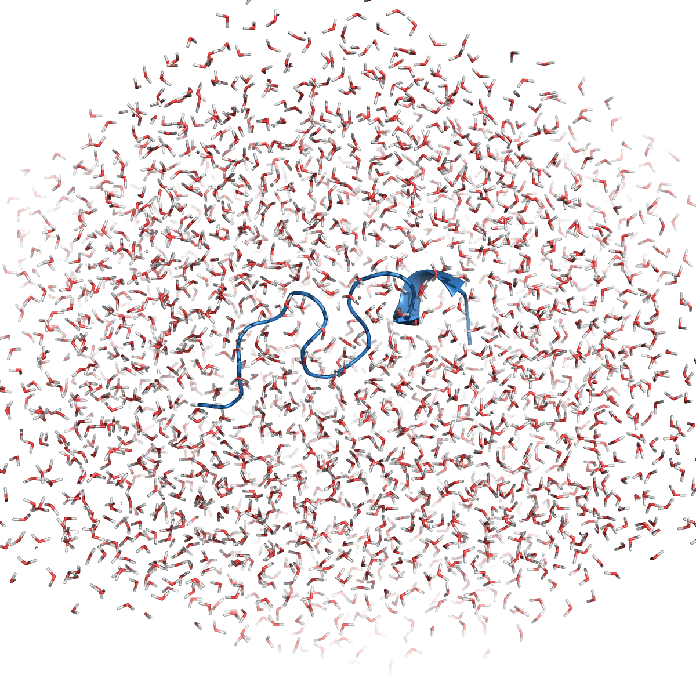

# hydropathy
[](https://github.com/biomodeling/hydropathy)

[](https://www.frontiersin.org/articles/10.3389/fmolb.2021.626837/full)
[](https://github.com/biomodeling/hydropathy/blob/master/LICENSE.md)

`hydropathy` is a script written in `python` that calculates the orientation of water modecules around a solute. 

## Theoretical foundations
Given a water molecule, it is possible to construct a tetrahedron having the oxygen atom as its center and the two real (**H1**, **H2**) and two _virtual_ (**LP1**, **LP2**) hydrogens as vertices.

Considering each water molecule and the nearest solute atom, a vector is defined that connects the solute atom with the oxygen atom of the water particle (**R**). 

We also define the vectors joining the center of the tetrahedron with the four vertices (**H1**, **H2**, **LP1**, **LP2**) and the dipole vector obtained as **d** = **H1** + **H2**. 

By measuring the angles formed by **R** with **H1**, **H2**, **LP1**, **LP2** and **d**, the hydropathy of the solute can be characterized.

More information on theory can be found <a href="https://www.frontiersin.org/articles/10.3389/fmolb.2021.626837/full" target="_blank">here</a> and <a href="https://pubs.acs.org/doi/10.1021/jp500980x" target="_blank">here</a>


## Installation
`hydropathy` is not released on PyPi. You can install it from the GitHub repo as follows
```bash
pip install git+https://github.com/biomodeling/hydropathy.git
```


## Usage
The script takes as parameters:
- an absolute input path that contains a set of files in pdb format of the solute + solvent system
- an absolute output path where the results will be written
- the water model used (`tip3p`, `tip4p`, `tip5p`, `spc`)

From your shell for example you can directly launch
```bash
hydropathy -i /<your>/<input>/<path>/ -o /<your>/<output>/<path> -w <water_model>
```

### Tutorial
To test the operation of the script you can use the two pdbs contained in `data/input_pdbs`. These are two frames of a tc10b molecular dynamics solvated with spc water molecules in triclinic box. 

<p align="center">
    
</p>

**NOTE:** only two pdbs are not sufficient to produce statistically significant data, and should be taken only as an example

Download the contents of `data/input_pdbs` and run
```bash
hyrdopathy -i /<your>/<root>/data/input_pdbs/ -o /<your>/<output>/<path>/ -w spc
```
Upon completion, you will get the results as those contained in `/data/output_files/`


## Output
The output consists of a series of files of the type `<resno>_<resname>.csv`, one for each solute residue. Each file contains 6 columns: `distance, theta1, theta2, theta3, theta4, theta_d`, where:

- `distance`: is the distance (expressed in Å) between the oxygen atom of a water molecule (center of the tetrahedron) and the nearest solute atom (excluding hydrogens), if the latter is at a distance less than 6Å (**R**)
- `theta1, ..., theta4`: are the angles formed between **R** and the vectors joining the center and vertices of the tetrahedron (**H1**, **H2**, **LP1**, **LP2**); all angles are expressed in degrees (°)
- `theta_d`: is the dipole angle, formed between **R** and the dipole vector **d** = **H1** + **H2** 

**NOTE:** blank files represent residues not exposed to water.


## Cite
If you use `hydropathy` in a scientific publication, please cite:

- L. Di Rienzo, M. Miotto, L. Bò, G. Ruocco, D. Raimondo, and E. Milanetti (2021). *Characterizing Hydropathy of Amino Acid Side Chain in a Protein Environment by Investigating the Structural Changes of Water Molecules Network.* Frontiers in Molecular Biosciences (Vol. 8). Frontiers Media SA. https://doi.org/10.3389/fmolb.2021.626837

- S. Bonella, D. Raimondo, E. Milanetti, A. Tramontano, and G. Ciccotti (2014). *Mapping the Hydropathy of Amino Acids Based on Their Local Solvation Structure* The Journal of Physical Chemistry B 2014 118 (24), 6604-6613 DOI: 10.1021/jp500980x

```
@article{Di_Rienzo_2021, 
  title={Characterizing Hydropathy of Amino Acid Side Chain in a Protein Environment by Investigating the Structural Changes of Water Molecules Network}, 
  volume={8}, 
  ISSN={2296-889X}, 
  url={http://dx.doi.org/10.3389/fmolb.2021.626837}, 
  DOI={10.3389/fmolb.2021.626837}, 
  journal={Frontiers in Molecular Biosciences}, 
  publisher={Frontiers Media SA}, 
  author={Di Rienzo, Lorenzo and Miotto, Mattia and Bò, Leonardo and Ruocco, Giancarlo and Raimondo, Domenico and Milanetti, Edoardo}, 
  year={2021}, 
  month=feb 
}

@article{Bonella2014,
  title = {Mapping the Hydropathy of Amino Acids Based on Their Local Solvation Structure},
  volume = {118},
  ISSN = {1520-5207},
  url = {http://dx.doi.org/10.1021/jp500980x},
  DOI = {10.1021/jp500980x},
  number = {24},
  journal = {The Journal of Physical Chemistry B},
  publisher = {American Chemical Society (ACS)},
  author = {Bonella,  S. and Raimondo,  D. and Milanetti,  E. and Tramontano,  A. and Ciccotti,  G.},
  year = {2014},
  month = jun,
  pages = {6604–6613}
}
```